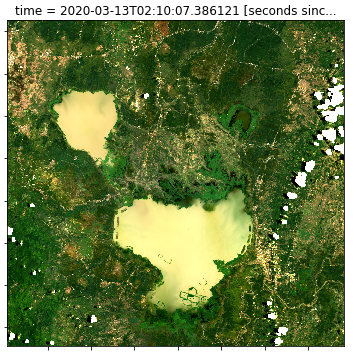

# EASI Notebooks 

Jupyter notebooks for learning and advancing your use of EASI, https://research.csiro.au/cceo/underpinning-technologies/earth-analytics/.

- Use the examples in these notebooks to build your own data analysis and applications.
- These notebooks have been adapted and write for CSIRO's EASI deployments.

These notebooks build on and contribute to the [Open Data Cube](https://github.com/opendatacube), [CEOS](https://ceos.org) and cloud-based EO analytics communities ([Acknowledgment and Credit](#Acknowledgment-and-Credit)).

<figure align="right">
    
    <figcaption><i>Lake Tempe, Indonesia. Landsat-8 (2020-03-13) RGB</i></figcaption>
</figure>

## Overview

#### tutorials/

- Notebooks that introduce aspects of EASI, Dask and the Open Data Cube libraries.
- Work through these as a Training exercise, and refer back to them for examples.

#### datasets/
- Demonstrations for accessing and using EASI data products.
- Adapt or copy from these for your own work.

#### case-studies/
- Science applications and examples.

#### html/
- HTML version of each notebook for easy browsing.

#### tools/
- Helper scripts used in the these notebooks.

#### resources/

- Supplementary files and images used in the EASI notebooks.

#### bin/

- Scripts for managing and contributing to the repository.

## Contributing

Contributions are welcome.

A `pre-commit` hook is provided in `/bin`. For each notebook committed this will:

1. Create an HTML copy of the notebook into `html/`.
1. Strip *outputs* from the notebook to reduce the size of the repository.

The `apply_hooks.sh` script creates a symlink to `bin/pre-commit`.

```bash
# Run this in your local repository
sh bin/apply_hooks.sh
```

For contributors:

1. Apply the pre-commit hook.
1. Run each notebook (that has been updated) to populate the figures, tables and other *outputs* as you want them.
1. Add a link into `html/readme.md` for each new notebook.
1. Add an item to `whats_new.md`.
1. `git add` and `git commit`.
1. If everything looks ok, `git push` to your fork of this repository and create a *pull request*.

#### pre-commit-config.yaml

Work in progress (not configured yet).

## Acknowledgment and Credit

Many of the notebooks and code have been built on top of and with a range of community contributions, learnings and experience. Most notebooks will provide acknowledgments or references where appropriate. Please add an issue or PR if you identify a contribution that you would like to see acknowledged appropriately. We acknowledge broad based contributions from the community:

- **Digital Earth Australia**, https://github.com/GeoscienceAustralia/dea-notebooks
  - ANU-DEA Introduction course (via Digital Earth Australia), https://github.com/ANU-WALD/dea_course/tree/master/dea_materials
- **Digital Earth Africa**, https://github.com/digitalearthafrica/deafrica-sandbox-notebooks
- **Open Data Cube and STAC tools**, https://github.com/opendatacube/odc-stac/tree/develop/notebooks
   - https://github.com/Element84/geo-notebooks
- **EOCSI Hackathon 2022**, https://github.com/csiro-easi/eocsi-hackathon-2022
- **Open Earth Alliance**, https://github.com/ceos-seo/odc-colab
- **CEOS Systems Engineering Office**, https://github.com/ceos-seo/data_cube_notebooks
- **UK Catapult and Commonsensing**, https://github.com/SatelliteApplicationsCatapult/odc-hub
- **Swiss Data Cube**, https://github.com/GRIDgva/SwissDataCube
- **CEOS Jupyter notebooks seminar series**, https://ceos.org/meetings/jupyter-notebooks-for-capacity-development-webinar

## License

Apache License 2.0, <https://www.apache.org/licenses/LICENSE-2.0>.
